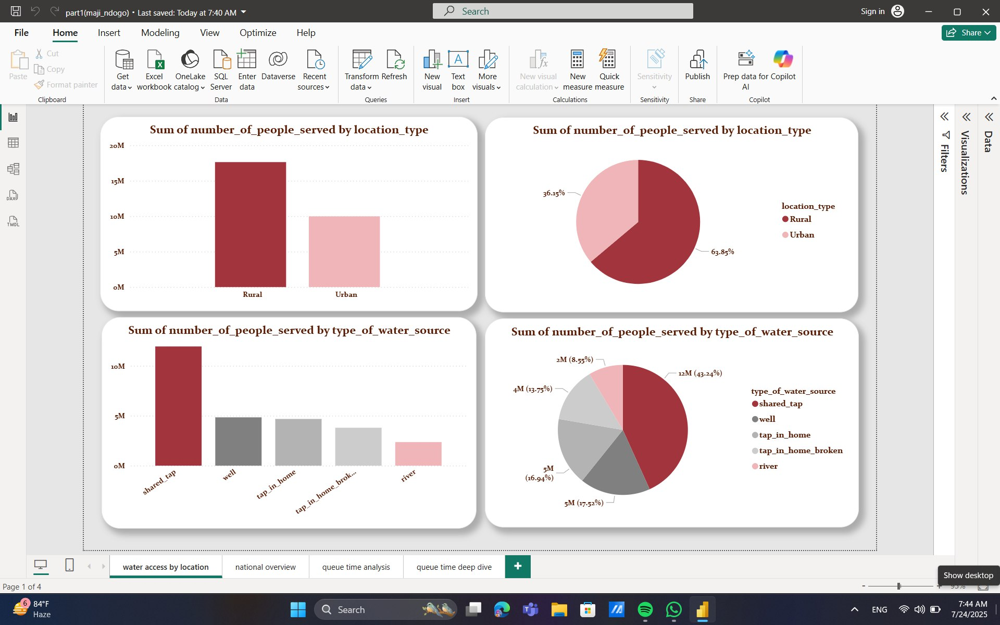
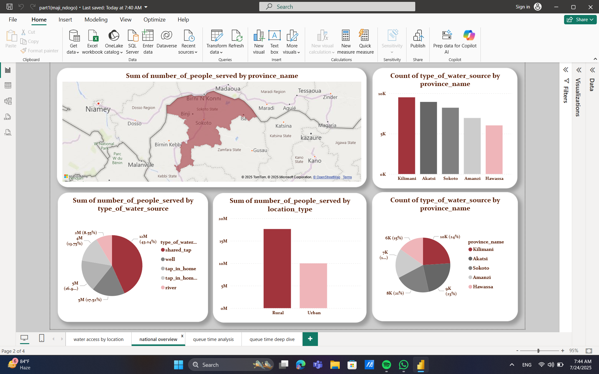
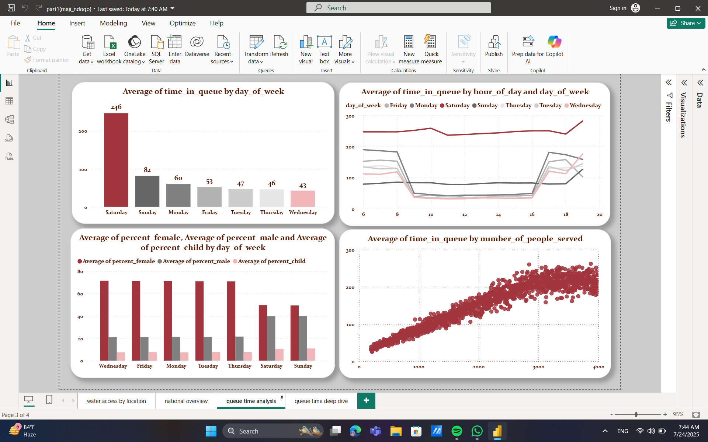

# Power BI Project – Maji Ndogo Water Access Analysis

This project was created as part of the **ALX Data Visualization Sprint** using Power BI.

**Maji Ndogo** is a fictional city used to simulate real-world challenges in water access.  
The project aims to analyze the situation using one dataset and create meaningful insights.

---

##  Dataset

- `md_summary.csv` 
- It contains fields:  
  - `province_name`, `location_type`, `source_type`  
  - `population_served`, `queue_time`, `weekday`, `hour`  
  - `percent_male`, `child_percent`, `percent_female`

The analysis did not require multiple table relationships — all visuals are based on this summary dataset.

---

##  Report Pages

### 1. Water Access by Location  
Bar and pie charts comparing source types by area

### 2. National Overview – Sources  
Source types, population and province insights

### 3. Queue Time Analysis 
Queue time by weekday, gender and children distribution

### 4. Queue Time Deep Dive  
Congestion by hour and beneficiaries served

---

##  Storytelling

The report follows a structured storyline:
- Where are the gaps in access?
- When is congestion highest?
- Who is most affected?
- Are resources allocated fairly?

---

##  Files in Repository
-  [Power BI Report (.pbix)](part1(maji_ndogo).pbix)
-  [Dataset (.csv)](Md_summary.csv)
-  [GeoJSON Map](MD_Provinces.json)
-  [ALX Project Brief](Part_1.pdf)
-  [Sprint Weekly Test](./part1/weekly_test.pdf)

---

##  External Link

- LinkedIn project write-up: []

---

##  Tools

- Power BI Desktop  
- Power Query  
- GeoJSON Map  
- CSV file 

---

## 📸 Report Screenshots

